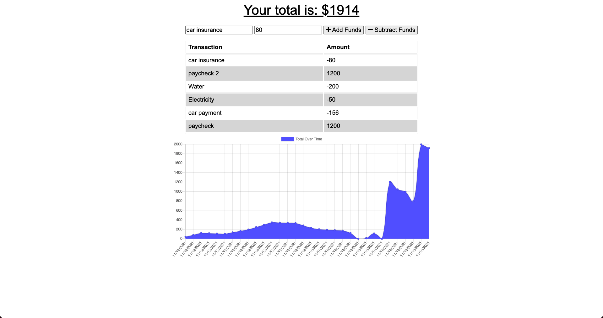

# Budget-tracker

## Description
This is a Budget Tracker app that is a progressive web app that will allow the user to access and function the app while offline. The user can enter a note, and a value into the input section, and state whether the value will be added or deducted from the balance in real time. If the user is offline, then the user will still be able to function the app. 

## Notes 
This application uses: 
- Express
- Mongoose
- web app manifest 
- service worker
- indexed db

## Usage 

[Heroku Link Here --](https://budget-tracker-kalanim.herokuapp.com/)

## Author

Kalani Mojica

- [Github](https://github.com/mojikalani)

- [LinkedIn](https://www.linkedin.com/in/kalani-mojica-132042206/)